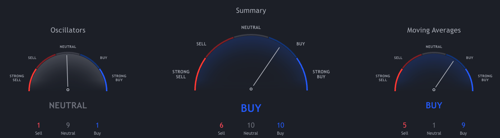

# TradingView_Technical_Analysis_API

Use at your own risk.

A fast and easy way to analyze Cryptocurrencies Technical analysis gauges display real-time ratings for the selected timeframes. The summary for Bitcoin / TetherUS is based on the most popular technical indicators — Moving Averages, Oscillators and Pivots. Results are available at a quick glance.

# Installation

Set up Python virtual environment

```
python -m venv ENV
```

Switch into the virtual environment

```
source ENV/bin/activate
```

Install packages

```
pip install -r requirements.txt
```

Start API

```
python app.py
```

# Usage

Sample URL below is how we fetch BTCUSDT pair from Binance on a 1 Day chart.

```
http://localhost:5000/<SYMBOL>/<SCREENER>/<EXCHANGE>/<INTERVAL>
EXAMPLE:
https://tradingview-technical-analysis.herokuapp.com/BTCUSDT/crypto/BINANCE/1d
```

Available Parameters:

```
Symbol (str) – (e.g., "AAPL", "TLKM", "USDEUR", "BTCUSDT").
Exchange (str) –  (e.g., "nasdaq", "idx", Exchange.FOREX, "binance").
Screener (str) –  (e.g., "america", "indonesia", "forex", "crypto").
Interval (str) - (1m, 5m, 15m, 30m, 1h, 2h, 4h, 1d, 1w, 1month)
```

Available Interval:

```
1m, 5m, 15m, 30m, 1h, 2h, 4h, 1d, 1w, 1month
```

API Response Sample:

```
{"RECOMMENDATION": "NEUTRAL", "BUY": 9, "SELL": 8, "NEUTRAL": 9}
```

The result should be the same as shown here: https://www.tradingview.com/symbols/BTCUSDT/technicals/



You can use the link below to test your pair: https://tradingview.brianthe.dev/

# Full Credit @brian-the-dev

https://github.com/brian-the-dev/python-tradingview-ta
